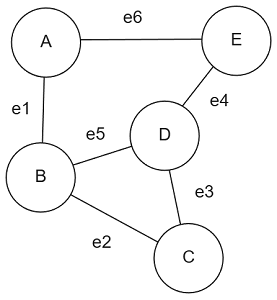
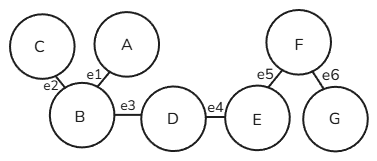
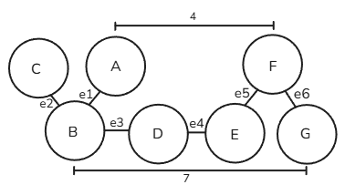
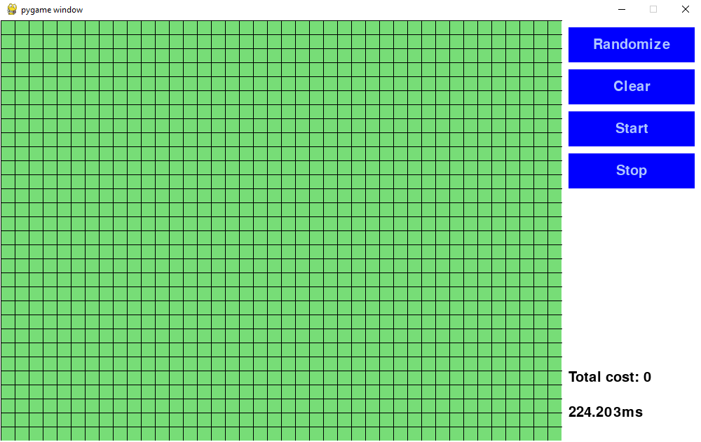
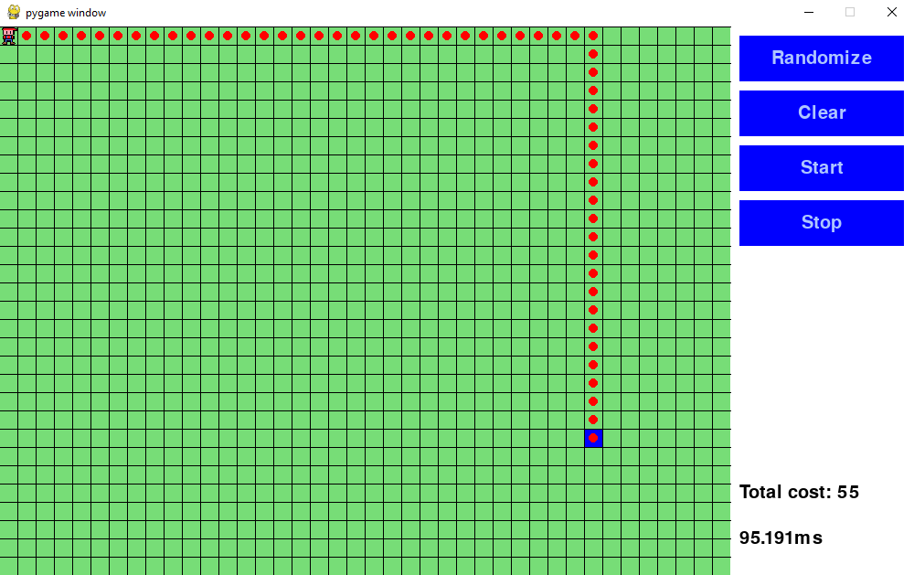

# 1. Uvod
Mnogi se problemi u domeni informatike i znanosti mogu generalizirati kao pronalaženje puta u grafovima.
Algoritmi pretraživanja su stoga vrlo bitni.
Primjeri problema koja možemo riješiti pomoću tih algoritama su:
 - navigacija i prostorna orijentcija
 - video igre
 - telekomunikacijske mreže
 - logistika i tranport
 - urbanističko planiranje
 - robotika
 - dizajn tiskanih ploča

 
Graf je skup čvorova povezanih međusobno pomoću bridova. 
U nekim je problemima potrebno uz čvor dodati i neku vrijednost koja označava njegovu težinu. Na primjer možemo razmišljatu o problemu pronalaska puta između gradova. Svaki grad je čvor u grafu i svaka cesta koje povezuje gradove je brid u grafu. Tada možemo uz čvor dodati i broj koji predstavlja udaljenost između gradova. Možemo si postaviti pitanje koji je najbrži put od jednog do drugog. Jedan način na kojem bismo to mogli učiniti je taj da pogledamo sve mogućnosti koje su nam dostupne. Taj algoritam nebi bio brz i efikasan jer bi trošio računalne i memorijske resurse u ne optimalne smijerove. Postoji bolji način za riješavanje tih problema poput algoritama za pretraživanje. U ovom ćemo radu detaljnije pogledati A* algoritam za pretraživanje.

Za potrebe rada razvili smo simulaciju igrice u Pythonu u kojoj koristimo A* algoritam za pronalaženje najkraćeg puta od početne do krajnje točke. U simulaciju je moguće dinamički dodati razna polja karakterizirana po brzini kretanja i prepreka. Za prikaz mape koristimo 2D vizualizaciju mreže u kojoj se igrač može kretati samo u vodoravnom i okomitom smjeru. Svaka ćelija mape predstavlja čvor u našem grafu i sve su susjedne čelije međusobno povezane.
Kod svake promjene na mapu koristmo A* algoritam kako bismo pronašli najbrži put od trenutne pozicije igrača do krajnjeg cilja.

## Opisati još što ćemo proći u svakom poglavlju
## Poglavlje 2.
# 2. A* algoritam

## 2.1 Osnovni pojmovi

**Definicija 2.1.** ***Graf*** *$G$ je uređena trojka $G = (V(G), E(G), \psi_G)$, koja se sastoji od nepraznog skupa $V = V(G)$, čiji su elementi vrhovi grafa $G$, skupa $E = E(G)$ disjunktnog sa $V(G)$, čiji su elementi bridovi grafa $G$, i funkcije incidencije $\psi_G$, koja svakom bridu grafa $G$ pridružuje neuređeni par (ne nužno različitih) vrhova grafa $G$.*

**Primjer 1.1.** Graf $G = (V, E, \varphi)$, gdje je $V = \{A, B, C, D, E\}$ s bridovima $E = \{e_1, e_2, e_3, e_4, e_5, e_6\}$. Funkcija incidencije tada bi bila:
$\varphi(e_1) = \{A, B\}, \varphi(e_2) = \{B, C\}, \varphi(e_3) = \{C, D\},  \varphi(e_4) = \{D, E\}, \varphi(e_5) = \{D, B\}, \varphi(e_6) = \{A, E\}$

**Slika 1**: Graf $G = (V, E, \varphi)$

**Definicija 2.3.** ***Šetnja*** *u grafu $G$ je netrivijalan konačan niz $W = v_0 e_0 v_1 e_1 \dots e_{k-1} v_k$ vrhova i bridova u $G$ takvi da je $e_i = \{v_i, v_{i+1}\}$ za sve $i < k$.*

**Definicija 2.4.** *Neka je $W = v_0 e_0 v_1 e_1 \dots e_{k-1} v_k$ šetnja u grafu $G$. Ako su u šetnji $W$ svi bridovi međusobno različiti, tada $W$ zovemo **staza**. Ako su svi vrhovi u šetnji međusobno različiti, onda šetnju $W$ zovemo **put.***

**Definicija 2.5.** *Kažemo da su dva čvora $u, v \in V$ **povezani** $\Leftrightarrow$ postoji put $P$ između $u$ i $v$.*

**Definicija 2.6.** *Neka je $P$ put između dva čvora $u, v \in V$, a neka je $n$ čvor koji se nalazi na putu. Kažemo da je $n'$ **nasljednik čvora** $n$ ako je $(n, n') \in P$, tj. ako pratimo put $P$, sljedeći čvor koji bismo posjetili nakon što stignemo do $n$ bio bi $n'$.*

**Definicija 2.7.** *Ako je $u \in V$, definiramo **povezanu komponentu čvora** $u$ kao*
$$C_u = \{v \in V \mid u \text{ i } v \text{ su povezani}\}$$
*što je podgraf grafa $G$.*

**Definicija 2.8** *Neka je $G = (V, E)$ težinski graf s težinskom funkcijom $w : E(G) \to \mathbb{R}$ i neka je $p = v_0 e_0 v_1 e_1 \dots e_{k-1} v_k$ put u grafu $G$. **Težina puta** $p$ definira se kao suma svih težina bridova koji su sadržani u putu:*
$$w(p) = \sum_{i=1}^{k-1} w(e_{i-1}, e_i)$$

**Definicija 2.9.** ***Težina najkraćeg puta** $\delta(u, v)$ između vrhova $u, v \in V(G)$ definira se kao:*
$$
\delta(u, v) =
\begin{cases}
\min\{w(p) : p \text{ put od } u \text{ do } v\}, & \text{ako postoji put od } u \text{ do } v \\
\infty, & \text{inače}
\end{cases}
$$
Najkraći put od vrha $u$ do vrha $v$ tada je definiran kao bilo koji put $p$ s težinom $w(p) = \delta(u, v)$.

**Definicija 2.10.** *Ako algoritam $A$ uvijek pronađe optimalni put između izvornog čvora i preferiranog ciljnog čvora, kažemo da je $A$ prihvatljiv.*

**Definicija 2.11.** *Neka je izvorni čvor i skup ciljanih čvorova u grafu $G = (V, E)$. Definiramo ocjenu kao funkciju $f : V \to \mathbb{R}$ definiranu kao*
$$f(u) = g(u) + h(u)$$
*gdje je $g(u)$ procjena optimalne udaljenosti od izvornog čvora do čvora $u$, a $h(u)$ procjena optimalne udaljenosti od čvora $u$ do jednog od njegovih preferiranih ciljnih čvorova. Obično nazivamo $g$ g-ocjena, a $h$ h-ocjena.*

## Dijkstrin algoritam - trebati će modificirati ovo

Da bismo mogli razumjeti pathfinding algoritam A*, prvo moramo razumjeti algoritam na kojem je A* baziran - odnosno ***Dijskstra's algorithm***.

Dijkstrin algoritam je algoritam za pronalaženje najbržeg puta od početnog čvora do bilo kojeg drugog čvora u grafu koristeći *težinu bridova* između susjednih čvorova. Algoritam traži najkraći put tako da uvijek bira čvorove čiji su povezani bridovi najmanje *težine*, a zatim istražuje njegove susjede. Ovaj se postupak ponavlja sve dok se ne pronađe najkraći put od početnog čvora do cilja. 

S Dijkstrinim algoritmom moramo biti oprezni kada imamo graf u kojemu je cilj povezan s čvorovima koji imaju *velike* težine ili barem težine *veće* od čvorova koji se nalaze *dalje* od cilja: 

**Slika 2**: Graf $G$

Ako počinjemo od čvora $A$ i cilj nam je čvor $C$ i ako je brid $e_2$ *teži* od bridova $e_3,e_4,e_5$ i $e_6$, Dijkstrin algoritam će $e_2$ zadnje provjeriti u cijelom grafu $G$, odnosno provjeravati će bespotrebno sve ostale čvorove. U ovom primjeru to možda nije veliki problem, ali ako uzmete npr. primjenu pathfinding algoritama na navigacijskim sustavima, tada ovo postaje veliki problem zato jer algoritam neće uzeti u obzir *smjer* u kojem treba *šetati*. Rezultat toga je bespotrebno pretraživanje i *šetanje* po nebitnim čvorovima što zauzvrat produžuje vrijeme izračuna najbržeg puta, uz bespotrebnu uporabu računalnih resursa itd.

Zbog tih razloga razvijen je A*, algoritam baziran na Dijkstrinom algoritmu, ali s dodanom funkcijom **heuristike**.

# Heuristika - i ovo modificirati
Slijepi postupci raspolažu isključivo egzaktnim informacijama na primjer početnim i trenutnim stanjem i ispitnim predikatom. Možemo poboljšati i ubrzati riješavanje problema ako uz te informacije koristimo i informacije o prirodi problema. Ako otprilike znamo smjer u kojim se nalazi riješenje možemo koristiti tu informaciju u našu korist.

Heuristika je postupak, koji pomoću iskustvena pravila o prirodi problema i osobinama cilja, vodi prema otkriću ili ga potiče.

## A* definicija

A* je pathfinding algoritam koji kombinira funkcionalnost Dijksrinog algoritma s dodatkom heuristika. Pomoću heuristika, algoritam može imati *"smisao smjera"*, odnosno uzeti u obzir preostalu udaljenost u računu težine puta:

$$f(p) = \sum_{i=1}^{k-1} w(e_{i-1}, e_i) + h(v_k)$$

gdje je:

- $f(p)$ ukupna težina puta p s heuristikom,
- $h(v_k)$ heuristička funkcija za čvor $v_k$, koja označava preostalu udaljenost od trenutnog čvora $v_k$ do cilja.

Ovim A* izbjegava puteve koji se udaljavaju od cilja i omogućava brže i učinkovitije traženje najkraćeg puta.

Za sliku 1 i 2, za funkciju heuristike možemo koristiti doslovnu udaljenost, odnosno euklidsku udaljenost između dva čvora.

**Slika 3**: Graf $G$

**Primjer:** za funkciju heuristike $h(v_k)$ od početnog čvora $B$ do ciljanog čvora $G$, funkcija će izgledati:

$$h(B)=7$$

Pošto smo razvili igricu u 2D mreži gdje svaki čvor je reprezentiran kao jedna *ćelija*, za funkciju heuristike $h(v_k)$ ne možemo koristiti euklidsku udaljenost već upotrebljavamo **Manhattan distance** ili **Manhattan udaljenost**.

Manhattan udaljenost je udaljenost između dvije točke u 2D polju, gdje se pomaci mogu izvršavati samo vertikalno ili horizontalno, bez dijagonalnih pomaka.

**Definicija 1.** *Ako su $A$ i $B$ točke u 2D polju, Manhattanova udaljenost između njih je:*

$$D_{\text{Man}} = \left| x_2 - x_1 \right| + \left| y_2 - y_1 \right|$$

*gdje*:

- *$\left| x_2 - x_1 \right|$ predstavlja razliku udaljenosti u horizontalnoj koordinati,*
- *$\left| y_2 - y_1 \right|$ predstavlja razliku udaljenosti u vertikalnoj koordinati.*

# Simulacija

# Zaključak
# Prilozi

